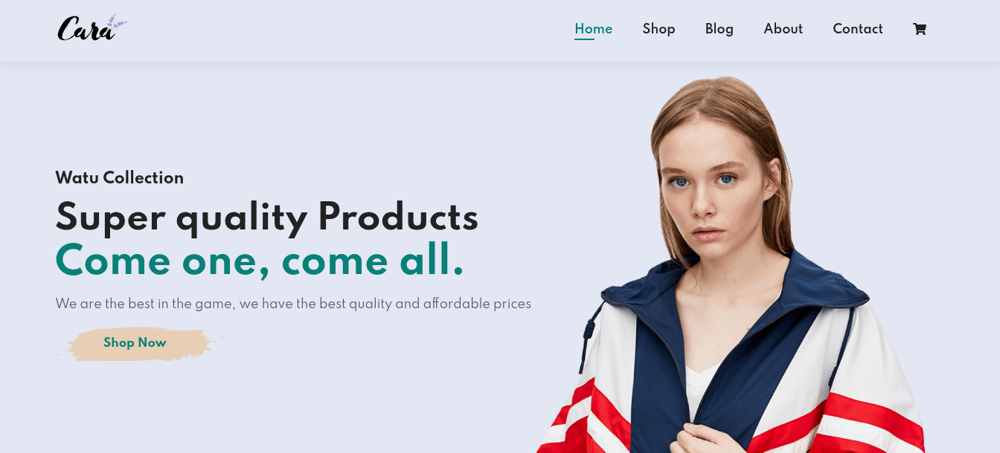
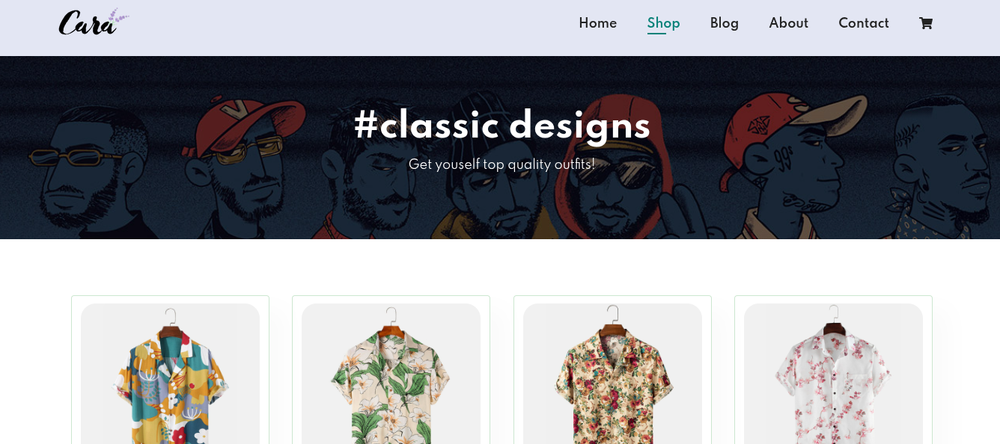
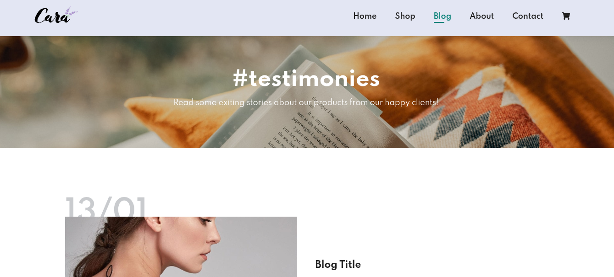
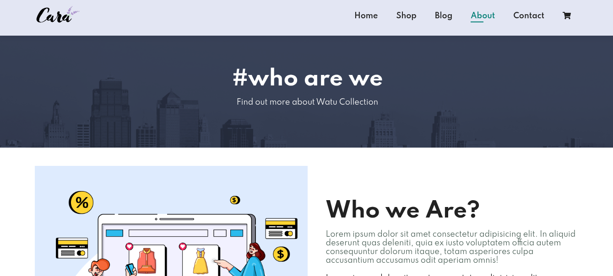
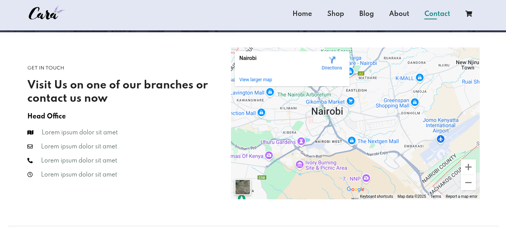

# Watu Collection - E-commerce Website

Watu Collection is a fully responsive e-commerce website designed to showcase and sell high-quality products. The website features a modern design, smooth navigation, and essential e-commerce functionalities.

## Website live url
[watu-collection link](https://raykaris.github.io/Watu-collection/)

## Features

- **Home Page**: Highlights featured products, new arrivals, and special offers.
- **Shop Page**: Displays a wide range of products with categories and pagination.
- **Product Details Page**: Provides detailed information about individual products.
- **Cart Page**: Allows users to view and manage their selected items.
- **Blog Page**: Shares stories and updates about the brand and its products.
- **About Page**: Introduces the brand and its mission.
- **Contact Page**: Enables users to get in touch with the team.

## Technologies Used

- **HTML5**: For structuring the content.
- **CSS3**: For styling and responsive design.
- **JavaScript**: For interactivity and dynamic content.
- **Font Awesome**: For icons.
- **Google Fonts**: For typography.


## How to Run

1. Clone the repository or download the project files.
```bash
git clone <project_url>
cd Watu-collection
```

## Screenshots

### Home Page


### Shop Page


### Blog Page


### About Page


### Contact Page



